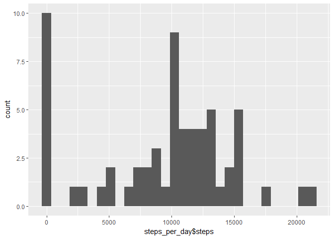
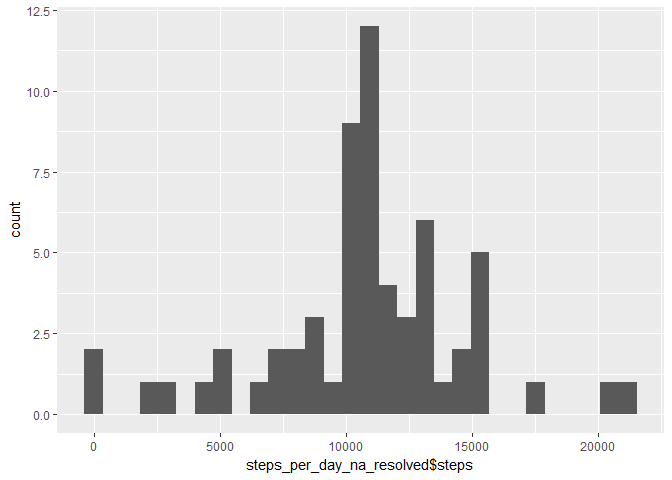
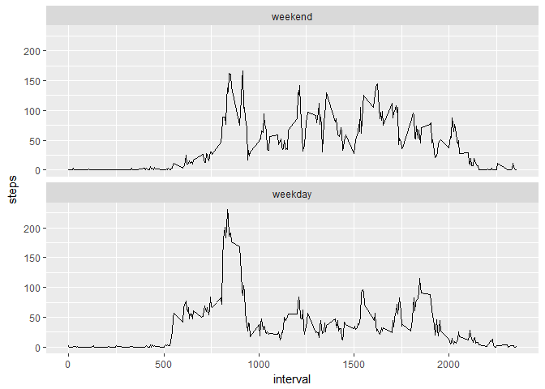

## Loading and preprocessing the data

Load the csv including the steps in a 5 minute interval with date from a fitness tracker. The unzipping and loading is done in a single step. The column classes are set according to the variables.

```r
fitness_data <- read.csv(unz("activity.zip", "activity.csv"), na.strings = "NA",
                   colClasses = c("integer", "Date", "integer"))
```

## What is mean total number of steps taken per day?

Calculate the steps per day and store it in a data frame.

```r
steps_per_day <- fitness_data %>% group_by(date) %>% summarize(steps = sum(steps, na.rm = TRUE)) %>% ungroup()
```

The histogram shows the total number of steps taken each day:

```r
qplot(steps_per_day$steps, geom = "histogram")
```

<!-- -->

The mean and the median total number of steps taken per day is shown below:

```r
steps_per_day_incl_na_mean <- mean(steps_per_day$steps)
steps_per_day_incl_na_med <- median(steps_per_day$steps)
```

The mean total number of steps is 9354.23 steps and the median total number of steps is 10395 steps.

## What is the average daily activity pattern?

Calculate the steps of the 5 minute intervals and the average number of steps taken, averaged across all days.

```r
five_minute_interval_avg_incl_na <- fitness_data %>% group_by(interval) %>% summarize(steps = mean(steps, na.rm = TRUE)) %>% ungroup()

ggplot(five_minute_interval_avg_incl_na, aes(interval, steps)) + geom_line()
```

<!-- -->

```r
max_five_min_int_avg_incl_na <- max(five_minute_interval_avg_incl_na$steps)
```

The maximum number of steps (on average across all days) for a 5-minute interval is 206.1698113.

## Imputing missing values

As there are some observations with missing values, the results may introduce bias into some calculations or summaries of the data. These missing values have to be replaced by using the mean of the corresponding interval. The reason for this decision was following:

It is not very likely that there is one interval containing only NA's. On the other hand, the dataset showed, that there are complete days containing only NA's.

```r
num_missing_observations <- sum(is.na(fitness_data$steps))

impute.mean <- function(x)
{
    replace(x, is.na(x), mean(x, na.rm = TRUE))
}

fitness_data_na_resolved <- fitness_data %>% group_by(interval) %>% mutate(steps = impute.mean(steps))
```

The histogram shows the total number of steps taken each day with NA's imputed:

```r
steps_per_day_na_resolved <- fitness_data_na_resolved %>% group_by(date) %>% summarize(steps = sum(steps)) %>% ungroup()
qplot(steps_per_day_na_resolved$steps, geom = "histogram")
```

<!-- -->

The mean and the median total number of steps (NA's imputed) taken per day is shown below:

```r
steps_per_day_na_resolved_mean <- mean(steps_per_day_na_resolved$steps)
steps_per_day_na_resolved_med <- median(steps_per_day_na_resolved$steps)
```

The mean total number of steps is 10766.19 steps and the median total number of steps is 10766.19 steps. For both values, NA's are imputed. The resulting mean and median are the same value, which cannot be observed with the dataset including NA's.
The biggest difference in the new histogram is that the zero step counts have dropped to a minimum and the average step count per day have increased.

## Are there differences in activity patterns between weekdays and weekends?

The dataset is adjusted to include a factor for weekdays and weekend. Afterwards a panel plot is drawn containing a time series like above in "What is the average daily activity pattern?" with imputed NA's and separation between weekdays and weekends.

```r
fitness_data_na_resolved_week <- fitness_data_na_resolved
fitness_data_na_resolved_week$weekend <- factor(isWeekday(fitness_data_na_resolved_week$date), levels = c(FALSE, TRUE), labels = c("weekend", "weekday"))
five_minute_interval_avg_na_resolved <- fitness_data_na_resolved_week %>% group_by(weekend, interval) %>% summarize(steps = mean(steps, na.rm = TRUE)) %>% ungroup()

ggplot(five_minute_interval_avg_na_resolved, aes(interval, steps)) + geom_line() + facet_wrap(~ weekend, ncol = 1)
```

<!-- -->

On weekends the number of steps is distributed more equally than on weekdays. As there are many more weekdays, the average daily pattern (incl NA) including weekends looks pretty the same like the weekday pattern above.
